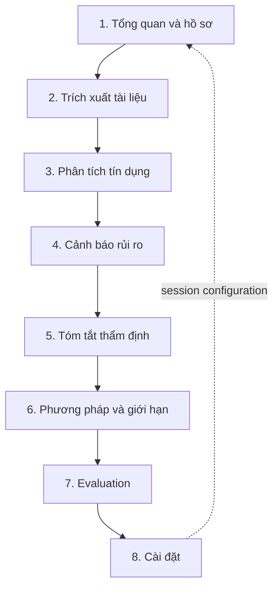

# CreditLens UI audit and state inventory

## 1. Method and evidence

The audit combines four evidence sources:

1. Source review of the actual Streamlit application, CSS, session state and page dispatch.
2. Read-only local inspection of all eight pages, including empty and representative synthetic-demo states.
3. Responsive inspection of the Overview at 1440, 1280 and 390 px, plus Light/Dark behavior from the current theme system.
4. Read-only production inspection of the current Overview.

No provider connection, AI summary or chat submission was made. UI inspection created **0 additional inference requests**.

The audit distinguishes three coverage levels:

- **Observed:** verified in the current local or production UI.
- **Exercised:** verified through deterministic AppTest/self-test/Evaluation test paths.
- **Specified:** required visual/interaction behavior for a future implementation but not yet present in the legacy UI.

## 2. Current information architecture

The numbered sidebar communicates sequence, but the application is not a strict wizard: Method, Evaluation and Settings are independent destinations, while pages 2–5 depend on a current case. The v2 IA therefore treats navigation as three groups rather than eight equal sequential steps:

- **Hồ sơ:** Tổng quan, Trích xuất, Phân tích, Cảnh báo, Tóm tắt.
- **Kiểm chứng:** Phương pháp và giới hạn, Evaluation.
- **Hệ thống:** Cài đặt.

The underwriting workflow remains a separate four-step process: **Tiếp nhận → Tính toán → Đối chiếu → Con người xem xét**. It must not be conflated with the eight-page navigation.

## 3. Eight-page inventory

| # | Page | Primary job | Current major states | Audit summary | Implementation boundary |
|---:|---|---|---|---|---|
| 1 | Tổng quan và hồ sơ | Create/open a case and initiate deterministic processing | Empty, upload mode, selected files, processing, partial warning, validation error, success, three case statuses | Strong guardrails but the primary intake is pushed below hero, notice and four large process cards; status appears too late | `Deferred to Cluster 3` |
| 2 | Trích xuất tài liệu | Inspect documents, normalized facts and confidence | No result, docs/no docs, extracted/unreadable/type mismatch, high/review/verify/missing confidence | Traceability is present; large dataframes dominate and confidence semantics are implemented inconsistently between HTML chips and styled cells | `Deferred to Cluster 4` |
| 3 | Phân tích tín dụng | Review source-of-income basis and Python metrics | No result, independently verified/declared-only, metric OK/warning/missing | Numeric hierarchy is useful; cards need a common density, threshold and evidence pattern | `Deferred to Cluster 4` |
| 4 | Cảnh báo rủi ro | Review rule findings and supporting evidence | No result, no-risk success, overall status, collapsed/expanded risk, evidence/no evidence | Expanders preserve focus but severity is mostly in text; overview/status and evidence hierarchy need consolidation | `Deferred to Cluster 4` |
| 5 | Tóm tắt thẩm định | Read deterministic summary, export, optionally request AI explanation | No result, export ready/error, disconnected/ready/invalid AI, disabled/loading/error/generated AI | Long uninterrupted page; deterministic result, export and optional AI need explicit sections and progressive disclosure | `Deferred to Cluster 5` |
| 6 | Phương pháp và giới hạn | Explain method, PDF support and limitations | Static content, table and warning | Content is clear but internal/page/sidebar naming differs; dense global chrome competes with an informational page | `Deferred to Cluster 5` |
| 7 | Evaluation | Run and inspect isolated deterministic evaluation | Pre-run, running, cached report, expanders, export | Explicit-run and zero-LLM boundaries are excellent; 11 sections need summary-first hierarchy and mobile treatment | `Deferred to Cluster 5` |
| 8 | Cài đặt | Manage AI connections, appearance, thresholds and guardrails | Four tabs; disconnected/connected; verification loading/error/success; chat disabled/active; valid/invalid form states | Sensitive input remains native, correctly; forms require clearer status ownership and responsive grouping | `Deferred to Cluster 6` |

## 4. Cross-page UI-state inventory

### 4.1 Global shell

| State | Current trigger | Required v2 representation |
|---|---|---|
| Default | Fresh session | Selected page, AI disconnected text, no active case badge |
| Selected | Sidebar route | Navy selected surface, red start edge, icon + label, `aria-current="page"` |
| Hover | Pointer over nav/control/card | Surface tint or border change only; essential meaning remains visible without hover |
| Focus | Keyboard focus | 2 px high-contrast ring with 2 px offset; never clipped |
| Disabled | Unavailable action | Muted surface/text, `disabled`, reason adjacent or in help text |
| Connected | Verified provider/model | Success icon + provider + model; never expose key/fingerprint |
| Disconnected | No verified connection | Neutral status: Python analysis remains available |
| Mobile | Width below 1024 | Sidebar becomes an accessible drawer; compact page/case context remains visible |
| Reduced motion | OS preference | No translate/ambient/page animation; state change stays immediate and understandable |

### 4.2 Overview and intake

| State | Current behavior | Required reference behavior |
|---|---|---|
| Empty | Empty upload controls and “Chưa có kết quả” info | Empty case summary, explicit required-document checklist and one clear primary action |
| Loading | Streamlit widget activity | Skeleton only for presentation; native uploader remains usable |
| Processing | `st.status` with two messages | Four-step progress with current step, text status and cancel only if backend supports it later |
| Success | Success message + result card | Success alert, persistent case summary and direct links to Extraction/Analysis/Risk/Summary |
| Warning | Partial-file list or review-required status | Warning alert tied to affected documents and next action |
| Error | No files, validation or parser error | Inline error summary above the affected intake panel; focus moves to it |
| Disabled | Run unavailable or busy | Button disabled with visible explanation; no hidden inference/network action |
| Selected | Upload mode or demo case | Segmented selection with text + visible checked state |
| Mobile | 390 px | Single column; intake before explanatory process detail; 44 px targets; no horizontal overflow |

### 4.3 Extraction

- **Default:** result present, document and normalized-field views available.
- **Empty:** no current case; show one concise empty state with a route back to Overview.
- **Loading/processing:** specified for future presentation while deterministic extraction runs; no fake percentages.
- **Success:** readable/extracted document and high-confidence field.
- **Warning:** type mismatch, review confidence or missing optional document.
- **Error:** unreadable document, invalid source, or table rendering failure.
- **Disabled:** evidence jump/download unavailable when no source exists.
- **Selected/hover/focus:** selected row and evidence link remain distinguishable with keyboard and not color alone.
- **Mobile:** tables become a controlled horizontal region or field cards; page-level layout never overflows.

### 4.4 Analysis

- **Empty:** no current case.
- **Success:** metric in illustrative range and independently verified income source.
- **Warning:** threshold attention, declared-only income, or missing verification.
- **Error:** reserved for a rendering/data-contract failure; missing values are not errors and display “Chưa đủ dữ liệu”.
- **Disabled:** unavailable evidence link or action.
- **Selected/hover/focus:** formula/evidence disclosure can be expanded without changing domain state.
- **Mobile:** one metric card per row; label, value, status, formula and evidence order remains intact.

### 4.5 Risk and evidence

- **Empty:** no current case.
- **Success:** explicit “Không phát hiện…” state; never imply credit approval.
- **Warning/error:** severity LOW/INFO, MEDIUM and HIGH are semantic risk states, not application exceptions.
- **Selected:** one disclosure expanded; selected state includes icon, severity label and border/fill.
- **Evidence absent:** warning “Thông tin chưa đủ”, not a fabricated citation.
- **Mobile:** evidence fields stack in order Document → page → field → value → excerpt.

### 4.6 Summary and export

- **Empty:** no current case and a route back to Overview.
- **Success:** deterministic summary rendered, chosen report generated, download ready.
- **Warning:** AI disconnected or invalid connection; deterministic output remains unaffected.
- **Error:** report generation or provider error; existing Python result remains visible.
- **Disabled:** AI action disabled until a verified connection/model exists.
- **Loading/processing:** export generation or AI generation uses a localized busy state.
- **Connected/disconnected:** provider/model status appears only in the optional AI section.
- **Mobile:** summary sections use accordions only for secondary evidence; export action stays reachable.

### 4.7 Method

- Static default content, responsive table, warning and focusable links.
- Loading, connected and processing states do not apply.
- Mobile uses stacked support rows if the three-column table cannot preserve readable content.

### 4.8 Evaluation

- **Empty/default:** explicit pre-run state with dataset scope and “Run Evaluation”.
- **Processing:** spinner with deterministic wording; no provider activity.
- **Success:** cached report, 36 cases/12 scenarios and `llm_api_calls = 0` visible in reproducibility.
- **Warning:** limitation or known failure case, not a failed evaluation run.
- **Error:** isolated error summary; current case/session remains untouched.
- **Disabled:** run button disabled only while the same run is active.
- **Mobile:** summary metrics first; large matrices/tables use controlled overflow and accessible captions.

### 4.9 Settings

- **Default/disconnected:** provider form, disabled active-connection selector and disabled chat input.
- **Loading:** provider verification/model refresh status.
- **Connected/success:** verified connection with provider/model and removal action.
- **Warning:** sensitive-data notice and illustrative-threshold disclaimer.
- **Error:** short/ambiguous key, API failure, invalid thresholds, short prompt or invalid config.
- **Disabled:** active model/chat/config action when prerequisite is missing.
- **Selected:** tab, active provider/model and theme.
- **Mobile:** tabs scroll with an affordance or become a select/list; form columns stack.

## 5. Audit by quality dimension

### Information architecture

**Works:** numbered pages match the underwriting mental model; Evidence and Method/Evaluation are visible; Settings is not hidden.  
**Gaps:** the four-step workflow is visually presented like navigation even though it is process state; dependent pages do not explain prerequisites consistently; current case context is not persistent; internal, sidebar and page names differ on page 6; page 7 breaks Vietnamese naming.

### Visual hierarchy

**Works:** strong co-branding, deterministic-first message and tabular numeric emphasis.  
**Gaps:** full hero and legal notice repeat on every page; the Overview’s primary task starts below the fold; fixed “current/next” process labels do not reflect actual state; long pages lack summary-first progressive disclosure.

### Spacing and layout

**Works:** max-width, card grids and basic mobile stacking exist.  
**Gaps:** spacing uses many unrelated values (5–18 px); radii span 4/6/8/10/12/999 px without roles; custom grids and Streamlit columns have no shared layout contract; fixed dataframe height and six-column metrics are fragile.

### Typography

**Works:** Inter and tabular figures are legible; hierarchy exists.  
**Gaps:** many labels/captions render around 9–12 px; nonstandard weights 650–850 are requested although only 400/500/600/700/800 are imported; typography is not tokenized; Google Fonts loading is network-dependent.

### Color and theme

**Works:** brand navy/crimson are consistent; system dark mode exists; state color is paired with text in most critical places.  
**Gaps:** numerous hard-coded light-theme colors bypass semantic tokens; Dark and Modern modes are incomplete semantic themes; complete foreground/background/border pairs are absent; contrast across all five legacy modes is not yet proven.

### Component consistency

**Works:** useful primitives exist for hero, notices, process cards, metrics and confidence labels.  
**Gaps:** custom HTML, native Streamlit widgets and broad test-id CSS selectors implement the same concepts differently; status uses emoji, pills, alert colors and styled cells without one contract; no shared empty/loading/error component.

### Navigation

**Works:** active item is prominent and labels remain visible.  
**Gaps:** native radio visuals are hidden; label focus is not explicitly designed; there are no deep links or persistent case/page cues; mobile depends entirely on the collapsed Streamlit sidebar.

### Responsive behavior

**Observed:** Overview has no horizontal page overflow at 390 px and custom grids stack.  
**Gaps:** the hero/process sequence makes the first input very far below the fold; 40 px controls are below the preferred 44 px coarse-pointer target; responsive contracts for 1280/1024/768/390 are not documented in the legacy UI; tables and Evaluation density need component-level fallback rules.

### Accessibility

**Works:** logo alt text, some ARIA labels, semantic headings, text labels for state, focus-visible rules and reduced-motion support.  
**Gaps:** no skip link/main landmark contract; custom notice/status containers lack live-region roles; sidebar focus treatment is uncertain after hiding native indicators; small type and theme contrast need formal validation; essential details must never rely on hover. Full WCAG verification belongs to Cluster 7.

## 6. Prioritized findings

| Priority | Finding | Design response | Disposition |
|---|---|---|---|
| P1 | Primary intake appears after repeated hero/notice/process content | Compact shell; place page task and intake first | `Deferred to Cluster 3` |
| P1 | No persistent case context across dependent pages | Add case-context bar/status badge in shell | `Deferred to Cluster 3` |
| P1 | State semantics vary across page/widget types | Adopt semantic state tokens and common status/alert/badge anatomy | Specified in Cluster 1; implementation deferred by page cluster |
| P1 | Small text and 40 px touch controls | Minimum 12 px supporting text and 44 px coarse-pointer targets | Implementation deferred by page cluster |
| P1 | Dark theme contains hard-coded light surfaces | Use semantic Light/Dark pairs only | `Deferred to Cluster 2–6` |
| P2 | Workflow rail is static and conflated with page navigation | Separate workflow status from IA and bind only to safe view-model state | `Deferred to Cluster 3` |
| P2 | Tables and six-column metric groups lack mobile fallback | Define table/card and metric reflow contracts | `Deferred to Cluster 4–5` |
| P2 | Google Fonts are network-dependent | Package approved font assets or use documented system fallback | `Deferred to Cluster 2` |
| P2 | Global CSS depends on Streamlit DOM/test-id selectors | Move custom presentation to scoped v2 components while retaining native widgets | `Deferred to Cluster 2–8` |

## 7. Deferred findings that must not be fixed in Cluster 1

- `Deferred to Cluster 2`: runtime token CSS, React/TypeScript package, view-model contracts, feature flag and legacy fallback.
- `Deferred to Cluster 3`: implement shell, Overview, compact mobile navigation, real workflow state and responsive uploader composition.
- `Deferred to Cluster 4`: implement Extraction/Analysis/Risk components. Normalize the mixed integer/`"—"` presentation type in the Extraction `Trang` column, which currently causes a non-fatal PyArrow conversion warning before Streamlit auto-fixes it.
- `Deferred to Cluster 5`: implement Summary/Method/Evaluation hierarchy and responsive tables.
- `Deferred to Cluster 6`: implement Settings/API/chat presentation while keeping secrets and chat input native.
- `Deferred to Cluster 7`: repair/version the stale eight-page AppTest navigation selector; full visual regression, keyboard, focus, contrast, overflow, screen-reader and production smoke coverage.
- `Deferred to Cluster 8`: remove unused legacy CSS/assets only after approved rollout and explicit confirmation.
